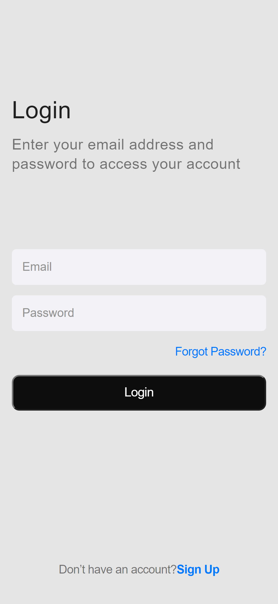

# App-from-CSS
 
 Criação de um tela de Login para um App.

> Resultado final da criação da tela de Login para um App.

### Ajustes e melhorias

Esse projeto tinha como objetivo desenvolver uma tela de login para um App, utilizando HTML e CSS. Ele ainda está em desenvolvimento e as próximas atualizações serão voltadas nas seguintes tarefas:

- [x] Criação do HTML
- [x] Criação do CSS
- [ ] Atualização do layout

## 🤝 Colaboradores

Agradecemos às seguintes pessoas que contribuíram para este projeto:

<table>
  <tr>
    <td align="center">
      <a href="https://www.linkedin.com/in/diego-reis-3b734922/">
         
        
          <b>Diego Reis</b>
        
      </a>
    </td>   
       
     
  </tr>
</table>

[⬆ Voltar ao topo](#App-from-CSS) 